# 🛡️ CPTS — Certified Penetration Testing Specialist

> My structured path toward the HTB CPTS certification.
>
> Five core domains → individual modules → technical notes → practical labs → enterprise capstone → CPTS exam.

> 📖 **Read these notes as a searchable site (diagrams, dark mode, offline search):** <https://romeo-mhakayakora.github.io/CPTS/>

---

## 🗺️ CPTS Interactive Map

> Every module below is clickable — it takes you directly to its notes.

```mermaid
flowchart TB
    CPTS["🛡️ CPTS<br/>Penetration Testing Specialist"]

    IG["🔎 INFORMATION GATHERING<br/>🟢 Strong"]
    WEB["🌐 WEB & APP SECURITY<br/>🟡 In Progress"]
    NET["🌐 NETWORK SECURITY<br/>🔴 Major Focus"]
    PRIV["🔐 PRIVILEGE ESCALATION<br/>🟡 In Progress"]
    ADMOD["🟦 ACTIVE DIRECTORY<br/>⬜ Not Started"]
    CAP["🏢 ENTERPRISE NETWORKS<br/>⬜ Capstone"]
    EXAM["🏁 CPTS EXAM"]

    CPTS --> IG & WEB & NET
    IG & WEB & NET --> PRIV
    PRIV --> ADMOD --> CAP --> EXAM

    subgraph IG_MODS ["01 — Information Gathering"]
        NMAP["✅ Nmap — 100%"]
        FOOT["🔄 Footprinting — 14.29%"]
        VULN["✅ Vuln Assessment — 100%"]
    end

    subgraph WEB_MODS ["02 — Web & App Security"]
        WEBED["✅ Web Edition — 100%"]
        PROXY["🔄 Web Proxies — 93.33%"]
        FFUF["✅ Ffuf — 100%"]
        BRUTE["🔄 Brute Forcing — 84.62%"]
        SQLI["✅ SQLi — 100%"]
        SQLMAP["🔄 SQLMap — 90.91%"]
        XSS["✅ XSS — 100%"]
        LFI["✅ File Inclusion — 100%"]
        UPLOAD["🔄 File Upload — 72.73%"]
        CMDI["🔄 Command Injection — 75%"]
        WEBATK["🔄 Web Attacks — 50%"]
        COMMONAPP["🔄 Common Apps — —"]
    end

    subgraph NET_MODS ["03 — Network Security"]
        SVC["🔄 Common Services — 21.05%"]
        PASS["🔄 Password Attacks — 15.38%"]
        PIVOT["🔄 Pivoting — 44.44%"]
        AD["🔄 Active Directory — —"]
        FT["✅ File Transfers — 100%"]
        SHELL["🔄 Shells & Payloads — 94.12%"]
        MSF["✅ Metasploit — 100%"]
    end

    subgraph PRIV_MODS ["04 — Privilege Escalation"]
        LINUX["🔄 Linux — 89.29%"]
        WINDOWS["🔄 Windows — 36.36%"]
    end

    subgraph AD_MODS ["05 — Active Directory"]
        ADINTRO["🔄 Intro — —"]
        ADOBJ["🔄 Objects — —"]
        ADMGMT["🔄 Users/OUs/Delegation — —"]
        ADGPO["🔄 GPOs — —"]
        ADAUTH["🔄 Authentication — —"]
        ADTRUST["🔄 Trusts — —"]
        ADDNS["🔄 Network & DNS — —"]
        ADBREACH["🔄 Breaching — —"]
        ADENUM["⬜ Enumeration — —"]
        ADATK["⬜ Attacks — —"]
        ADLAT["⬜ Lateral Movement — —"]
    end

    IG --- IG_MODS
    WEB --- WEB_MODS
    NET --- NET_MODS
    PRIV --- PRIV_MODS
    ADMOD --- AD_MODS

    click NMAP href "./01-information-gathering/network-enumeration-nmap.md"
    click FOOT href "./01-information-gathering/footprinting.md"
    click WEBED href "./02-web-application-security/information-gathering-web-edition.md"
    click VULN href "./01-information-gathering/vulnerability-assessment.md"
    click PROXY href "./02-web-application-security/using-web-proxies.md"
    click FFUF href "./02-web-application-security/attacking-web-applications-with-ffuf.md"
    click BRUTE href "./02-web-application-security/login-brute-forcing.md"
    click SQLI href "./02-web-application-security/sql-injection-fundamentals.md"
    click SQLMAP href "./02-web-application-security/sqlmap-essentials.md"
    click XSS href "./02-web-application-security/cross-site-scripting.md"
    click LFI href "./02-web-application-security/file-inclusion.md"
    click UPLOAD href "./02-web-application-security/file-upload-attacks.md"
    click CMDI href "./02-web-application-security/command-injections.md"
    click WEBATK href "./02-web-application-security/web-attacks.md"
    click COMMONAPP href "./02-web-application-security/attacking-common-applications.md"
    click SVC href "./03-network-security/attacking-common-services.md"
    click PASS href "./03-network-security/password-attacks.md"
    click PIVOT href "./03-network-security/pivoting-tunneling-port-forwarding.md"
    click AD href "./03-network-security/active-directory-enumeration-attacks.md"
    click FT href "./03-network-security/file-transfers.md"
    click SHELL href "./03-network-security/shells-payloads.md"
    click MSF href "./03-network-security/using-metasploit-framework.md"
    click LINUX href "./04-privilege-escalation/linux-privilege-escalation.md"
    click WINDOWS href "./04-privilege-escalation/windows-privilege-escalation.md"
    click ADINTRO href "./05-active-directory/ad-basics/windows-domains-intro.md"
    click ADOBJ href "./05-active-directory/ad-basics/ad-objects-accounts-organisation.md"
    click ADMGMT href "./05-active-directory/ad-basics/managing-users-ous-delegation.md"
    click ADGPO href "./05-active-directory/ad-basics/group-policy-objects.md"
    click ADAUTH href "./05-active-directory/ad-basics/authentication-kerberos-netntlm.md"
    click ADTRUST href "./05-active-directory/ad-basics/trees-forests-trusts.md"
    click ADDNS href "./05-active-directory/ad-basics/network-connection-dns.md"
    click ADBREACH href "./05-active-directory/breaching-ad/breaching-ad-intro.md"
    click ADENUM href "./05-active-directory/enumeration.md"
    click ADATK href "./05-active-directory/attacks.md"
    click ADLAT href "./05-active-directory/lateral-movement.md"
    click CAP href "./supporting/attacking-enterprise-networks.md"
```



### Legend

| Status | Meaning |
|--------|---------|
| 🟢 | Strong / largely completed |
| 🟡 | In progress |
| 🔴 | Major area of work |
| ✅ | Module completed |
| 🔄 | Currently in progress |
| ⬜ | Not started |
| 🔁 | Needs review / practical reinforcement |

---

## 📊 Overall Progress

| Domain | Status | Entry Point |
|--------|--------|-------------|
| 🔎 Information Gathering | 🟢 Strong | [Open →](./01-information-gathering/) |
| 🌐 Web & Application Security | 🟡 In Progress | [Open →](./02-web-application-security/) |
| 🌐 Network Security | 🔴 Major Focus | [Open →](./03-network-security/) |
| 🔐 Privilege Escalation | 🟡 In Progress | [Open →](./04-privilege-escalation/) |
| 🟦 Active Directory | ⬜ Not Started | [Open →](./05-active-directory/) |
| 🧰 Supporting Skills | ⬜ Not Started | [Open →](./supporting/) |

> ⚠️ **Note:** HTB completion percentage is not the same thing as CPTS readiness. Practical ability, repetition, enumeration discipline, and the ability to chain techniques together matter more than the percentage alone.

---

## 01 — 🔎 Information Gathering

> Reconnaissance, enumeration, fingerprinting and vulnerability discovery. → [Domain README](./01-information-gathering/README.md)

| Module | Progress | Status | Notes |
|--------|:--------:|:------:|:-----:|
| [Network Enumeration with Nmap](./01-information-gathering/network-enumeration-nmap.md) | 100% | ✅ | [📖](./01-information-gathering/network-enumeration-nmap.md) |
| [Footprinting](./01-information-gathering/footprinting.md) | 14.29% | 🔄 | [📖](./01-information-gathering/footprinting.md) |
| [Vulnerability Assessment](./01-information-gathering/vulnerability-assessment.md) | 100% | ✅ | [📖](./01-information-gathering/vulnerability-assessment.md) |

### 🎯 Domain Goal

Be able to systematically answer:

```text
What exists?
      ↓
What is exposed?
      ↓
What technologies are running?
      ↓
What versions are running?
      ↓
What vulnerabilities / attack surfaces exist?
      ↓
What should I attack first?
```

---

## 02 — 🌐 Web & Application Security

> Web enumeration, authentication attacks, injection, file attacks and application exploitation. → [Domain README](./02-web-application-security/README.md)

| Module | Progress | Status | Notes |
|--------|:--------:|:------:|:-----:|
| [Information Gathering – Web Edition](./02-web-application-security/information-gathering-web-edition.md) | 100% | ✅ | [📖](./02-web-application-security/information-gathering-web-edition.md) |
| [Using Web Proxies](./02-web-application-security/using-web-proxies.md) | 93.33% | 🔄 | [📖](./02-web-application-security/using-web-proxies.md) |
| [Attacking Web Applications with Ffuf](./02-web-application-security/attacking-web-applications-with-ffuf.md) | 100% | ✅ | [📖](./02-web-application-security/attacking-web-applications-with-ffuf.md) |
| [Login Brute Forcing](./02-web-application-security/login-brute-forcing.md) | 84.62% | 🔄 | [📖](./02-web-application-security/login-brute-forcing.md) |
| [SQL Injection Fundamentals](./02-web-application-security/sql-injection-fundamentals.md) | 100% | ✅ | [📖](./02-web-application-security/sql-injection-fundamentals.md) |
| [SQLMap Essentials](./02-web-application-security/sqlmap-essentials.md) | 90.91% | 🔄 | [📖](./02-web-application-security/sqlmap-essentials.md) |
| [Cross-Site Scripting](./02-web-application-security/cross-site-scripting.md) | 100% | ✅ | [📖](./02-web-application-security/cross-site-scripting.md) |
| [File Inclusion](./02-web-application-security/file-inclusion.md) | 100% | ✅ | [📖](./02-web-application-security/file-inclusion.md) |
| [File Upload Attacks](./02-web-application-security/file-upload-attacks.md) | 72.73% | 🔄 | [📖](./02-web-application-security/file-upload-attacks.md) |
| [Command Injections](./02-web-application-security/command-injections.md) | 75% | 🔄 | [📖](./02-web-application-security/command-injections.md) |
| [Web Attacks](./02-web-application-security/web-attacks.md) | 50% | 🔄 | [📖](./02-web-application-security/web-attacks.md) |
| [Attacking Common Applications](./02-web-application-security/attacking-common-applications.md) | — | 🔄 | [📖](./02-web-application-security/attacking-common-applications.md) |

### 🎯 Domain Goal

Build the ability to move from:

```text
Web Enumeration
       ↓
Technology Identification
       ↓
Endpoint / Parameter Discovery
       ↓
Authentication Testing
       ↓
Input Validation Testing
       ↓
Exploit
       ↓
Initial Access
       ↓
Shell / Credential / Data
```

---

## 03 — 🌐 Network Security

> Services, credentials, lateral movement, tunneling, Active Directory and remote access. → [Domain README](./03-network-security/README.md)

| Module | Progress | Status | Notes |
|--------|:--------:|:------:|:-----:|
| [Attacking Common Services](./03-network-security/attacking-common-services.md) | 21.05% | 🔄 | [📖](./03-network-security/attacking-common-services.md) |
| [Password Attacks](./03-network-security/password-attacks.md) | 15.38% | 🔄 | [📖](./03-network-security/password-attacks.md) |
| [Pivoting, Tunneling & Port Forwarding](./03-network-security/pivoting-tunneling-port-forwarding.md) | 44.44% | 🔄 | [📖](./03-network-security/pivoting-tunneling-port-forwarding.md) |
| [Active Directory Enumeration & Attacks](./03-network-security/active-directory-enumeration-attacks.md) | — | 🔄 | [📖](./03-network-security/active-directory-enumeration-attacks.md) |
| [File Transfers](./03-network-security/file-transfers.md) | 100% | ✅ | [📖](./03-network-security/file-transfers.md) |
| [Shells & Payloads](./03-network-security/shells-payloads.md) | 94.12% | 🔄 | [📖](./03-network-security/shells-payloads.md) |
| [Using the Metasploit Framework](./03-network-security/using-metasploit-framework.md) | 100% | ✅ | [📖](./03-network-security/using-metasploit-framework.md) |

### 🚨 Current Priority

```text
Attacking Common Services
          ↓
Password Attacks
          ↓
Pivoting / Tunneling
          ↓
Active Directory
```

These skills form a major part of the transition from attacking individual machines to attacking enterprise networks.

### 🎯 Domain Goal

```text
Initial Access
      ↓
Credentials
      ↓
Remote Services
      ↓
Network Discovery
      ↓
Pivot
      ↓
Reach Internal Network
      ↓
Enumerate AD
      ↓
Compromise Additional Hosts
      ↓
Lateral Movement
```

---

## 04 — 🔐 Privilege Escalation

> Turning initial access into higher privileges and deeper control of a compromised system. → [Domain README](./04-privilege-escalation/README.md)

| Module | Progress | Status | Notes |
|--------|:--------:|:------:|:-----:|
| [Linux Privilege Escalation](./04-privilege-escalation/linux-privilege-escalation.md) | 89.29% | 🔄 | [📖](./04-privilege-escalation/linux-privilege-escalation.md) |
| [Windows Privilege Escalation](./04-privilege-escalation/windows-privilege-escalation.md) | 36.36% | 🔄 | [📖](./04-privilege-escalation/windows-privilege-escalation.md) |

### 🎯 Domain Goal

```text
Initial Shell
     ↓
Enumeration
     ↓
Find Misconfiguration / Vulnerability
     ↓
Exploit
     ↓
Higher Privileges
     ↓
Root / SYSTEM
```

---

## 05 — 🟦 Active Directory

> Dedicated AD enumeration, attacks and lateral movement. → [Domain README](./05-active-directory/README.md)

| Module | Progress | Status | Notes |
|--------|:--------:|:------:|:-----:|
| [AD Basics](./05-active-directory/ad-basics/README.md) | — | 🔄 | [📖](./05-active-directory/ad-basics/README.md) |
| [Windows Domains and AD (Intro)](./05-active-directory/ad-basics/windows-domains-intro.md) | — | 🔄 | [📖](./05-active-directory/ad-basics/windows-domains-intro.md) |
| [AD Objects, Accounts and Organisation](./05-active-directory/ad-basics/ad-objects-accounts-organisation.md) | — | 🔄 | [📖](./05-active-directory/ad-basics/ad-objects-accounts-organisation.md) |
| [Managing AD Users, OUs and Delegation](./05-active-directory/ad-basics/managing-users-ous-delegation.md) | — | 🔄 | [📖](./05-active-directory/ad-basics/managing-users-ous-delegation.md) |
| [Group Policy Objects (GPOs)](./05-active-directory/ad-basics/group-policy-objects.md) | — | 🔄 | [📖](./05-active-directory/ad-basics/group-policy-objects.md) |
| [Authentication (Kerberos & NetNTLM)](./05-active-directory/ad-basics/authentication-kerberos-netntlm.md) | — | 🔄 | [📖](./05-active-directory/ad-basics/authentication-kerberos-netntlm.md) |
| [Trees, Forests and Trust Relationships](./05-active-directory/ad-basics/trees-forests-trusts.md) | — | 🔄 | [📖](./05-active-directory/ad-basics/trees-forests-trusts.md) |
| [Connecting to the Network and DNS](./05-active-directory/ad-basics/network-connection-dns.md) | — | 🔄 | [📖](./05-active-directory/ad-basics/network-connection-dns.md) |
| [Breaching AD](./05-active-directory/breaching-ad/README.md) | — | 🔄 | [📖](./05-active-directory/breaching-ad/README.md) |
| [Breaching AD (Intro) & Initial Credentials](./05-active-directory/breaching-ad/breaching-ad-intro.md) | — | 🔄 | [📖](./05-active-directory/breaching-ad/breaching-ad-intro.md) |
| [Enumeration](./05-active-directory/enumeration.md) | — | ⬜ | [📖](./05-active-directory/enumeration.md) |
| [Attacks](./05-active-directory/attacks.md) | — | ⬜ | [📖](./05-active-directory/attacks.md) |
| [Lateral Movement & Pivoting](./05-active-directory/lateral-movement.md) | — | ⬜ | [📖](./05-active-directory/lateral-movement.md) |

> Legacy overview kept at [03-network-security/active-directory-enumeration-attacks.md](./03-network-security/active-directory-enumeration-attacks.md) — new detailed notes live here.

### 🎯 Domain Goal

```text
Domain Discovery
      ↓
Enumerate Users / Groups / Trusts
      ↓
Kerberoast / AS-REP / Spray
      ↓
Lateral Movement
      ↓
Domain Admin
      ↓
Enterprise Compromise
```

---

## 🧰 Supporting Skills

> These aren't part of the four core domains, but they support the entire CPTS workflow. → [Open →](./supporting/)

| Module | Status | Notes |
|--------|:------:|:-----:|
| [Penetration Testing Process](./supporting/penetration-testing-process.md) | ⬜ | [📖](./supporting/penetration-testing-process.md) |
| [Getting Started](./supporting/getting-started.md) | ⬜ | [📖](./supporting/getting-started.md) |
| [Documentation & Reporting](./supporting/documentation-reporting.md) | ⬜ | [📖](./supporting/documentation-reporting.md) |

---

## 🏢 Enterprise Integration

### [Attacking Enterprise Networks](./supporting/attacking-enterprise-networks.md)

**Status:** ⬜ Not Started

→ [Open Capstone Notes](./supporting/attacking-enterprise-networks.md)

This is where the four domains need to come together.

```text
Information Gathering
        │
        ▼
Web / Application Attacks
        │
        ▼
Network Attacks
        │
        ▼
Initial Access
        │
        ▼
Privilege Escalation
        │
        ▼
Credential Discovery
        │
        ▼
Pivoting
        │
        ▼
Active Directory
        │
        ▼
Lateral Movement
        │
        ▼
Enterprise Compromise
        │
        ▼
Professional Report
```

---

## 📝 Notes Structure

Each module is a single notes file inside its domain folder:

```text
03-network-security/
├── README.md                        ← domain overview + module table
├── attacking-common-services.md
├── password-attacks.md              ← concepts, methodology, techniques, commands, labs, cheatsheet
├── pivoting-tunneling-port-forwarding.md
├── active-directory-enumeration-attacks.md
├── file-transfers.md
├── shells-payloads.md
└── using-metasploit-framework.md
```

Workflow:

```text
CPTS Dashboard
      │
      ▼
Network Security
      │
      ▼
password-attacks.md
      │
      ├── Concepts
      ├── Methodology
      ├── Techniques
      ├── Commands
      ├── Labs
      └── Cheatsheet
```

---

## 📈 CPTS Development Model

Completing a module is only the first stage.

```text
          ┌───────────────┐
          │   HTB MODULE  │
          └───────┬───────┘
                  ↓
          ┌───────────────┐
          │     NOTES     │
          └───────┬───────┘
                  ↓
          ┌───────────────┐
          │     LABS      │
          └───────┬───────┘
                  ↓
          ┌───────────────┐
          │   PRACTICE    │
          └───────┬───────┘
                  ↓
          ┌───────────────┐
          │   REPEAT      │
          └───────┬───────┘
                  ↓
          ┌───────────────┐
          │ CPTS READY?   │
          └───────────────┘
```

### Module readiness

A module is considered CPTS-ready when I can:

- [ ] Explain the underlying concepts
- [ ] Enumerate systematically
- [ ] Identify attack opportunities
- [ ] Execute the relevant techniques
- [ ] Troubleshoot when the obvious approach fails
- [ ] Document commands and evidence
- [ ] Apply the technique in an unfamiliar environment
- [ ] Combine it with other CPTS skills

### Module status levels

| Status | Meaning |
|--------|---------|
| ✅ Completed | HTB module done + notes written |
| 🔄 In Progress | Currently working through HTB content |
| ⬜ Not Started | Not yet begun |
| 🔁 Needs Review | HTB done, but needs practical reinforcement before CPTS-ready |

---

## 🎯 Current Priority

### 🔴 High Priority

- Attacking Common Services
- Password Attacks
- Pivoting, Tunneling & Port Forwarding
- Active Directory Enumeration & Attacks
- Windows Privilege Escalation

### 🟡 Finish Existing Progress

- Using Web Proxies
- Login Brute Forcing
- SQLMap Essentials
- File Upload Attacks
- Command Injections
- Web Attacks
- Linux Privilege Escalation
- Shells & Payloads

### 🟢 Completed / Maintain

- Network Enumeration with Nmap
- Information Gathering – Web Edition
- Vulnerability Assessment
- Ffuf
- SQL Injection Fundamentals
- Cross-Site Scripting
- File Inclusion
- File Transfers
- Metasploit

---

## 🏁 Final CPTS Roadmap

```text
┌──────────────────────────────┐
│  01  INFORMATION GATHERING   │
└──────────────┬───────────────┘
               ↓
┌──────────────────────────────┐
│  02  WEB & APP SECURITY      │
└──────────────┬───────────────┘
               ↓
┌──────────────────────────────┐
│  03  NETWORK SECURITY        │
│      ★ AD + PIVOTING         │
└──────────────┬───────────────┘
               ↓
┌──────────────────────────────┐
│  04  PRIVILEGE ESCALATION    │
│      ★ WINDOWS               │
└──────────────┬───────────────┘
               ↓
┌──────────────────────────────┐
│  PENETRATION TESTING PROCESS  │
└──────────────┬───────────────┘
               ↓
┌──────────────────────────────┐
│  DOCUMENTATION & REPORTING   │
└──────────────┬───────────────┘
               ↓
┌──────────────────────────────┐
│  ATTACKING ENTERPRISE        │
│  NETWORKS — CAPSTONE         │
└──────────────┬───────────────┘
               ↓
          ┌──────────┐
          │   CPTS   │
          │   EXAM   │
          └──────────┘
```

> **Objective:** Don't just complete the CPTS path. Build the ability to perform a complete penetration test from reconnaissance through exploitation, privilege escalation, lateral movement, Active Directory attacks, and professional reporting.

---

[⬆ Back to top](#)
