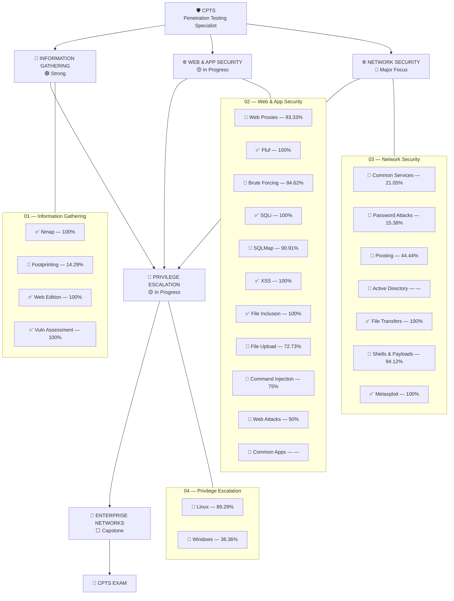

# 🛡️ CPTS — Certified Penetration Testing Specialist

> My structured path toward the HTB CPTS certification.
>
> Four core domains → individual modules → technical notes → practical labs → enterprise capstone → CPTS exam.

---

## 🗺️ CPTS Interactive Map

> Every module below is clickable — it takes you directly to its notes.



### Legend

| Status | Meaning |
|--------|---------|
| 🟢 | Strong / largely completed |
| 🟡 | In progress |
| 🔴 | Major area of work |
| ✅ | Module completed |
| 🔄 | Currently in progress |
| ⬜ | Not started |
| 🔁 | Needs review / practical reinforcement |

---

## 📊 Overall Progress

| Domain | Status | Entry Point |
|--------|--------|-------------|
| 🔎 Information Gathering | 🟢 Strong | [Open →](./01-information-gathering/) |
| 🌐 Web & Application Security | 🟡 In Progress | [Open →](./02-web-application-security/) |
| 🌐 Network Security | 🔴 Major Focus | [Open →](./03-network-security/) |
| 🔐 Privilege Escalation | 🟡 In Progress | [Open →](./04-privilege-escalation/) |
| 🧰 Supporting Skills | ⬜ Not Started | [Open →](./supporting/) |

> ⚠️ **Note:** HTB completion percentage is not the same thing as CPTS readiness. Practical ability, repetition, enumeration discipline, and the ability to chain techniques together matter more than the percentage alone.

---

## 01 — 🔎 Information Gathering

> Reconnaissance, enumeration, fingerprinting and vulnerability discovery. → [Domain README](./01-information-gathering/README.md)

| Module | Progress | Status | Notes |
|--------|:--------:|:------:|:-----:|
| [Network Enumeration with Nmap](./01-information-gathering/network-enumeration-nmap/) | 100% | ✅ | [📖](./01-information-gathering/network-enumeration-nmap/README.md) |
| [Footprinting](./01-information-gathering/footprinting/) | 14.29% | 🔄 | [📖](./01-information-gathering/footprinting/README.md) |
| [Information Gathering – Web Edition](./01-information-gathering/information-gathering-web-edition/) | 100% | ✅ | [📖](./01-information-gathering/information-gathering-web-edition/README.md) |
| [Vulnerability Assessment](./01-information-gathering/vulnerability-assessment/) | 100% | ✅ | [📖](./01-information-gathering/vulnerability-assessment/README.md) |

### 🎯 Domain Goal

Be able to systematically answer:

```text
What exists?
      ↓
What is exposed?
      ↓
What technologies are running?
      ↓
What versions are running?
      ↓
What vulnerabilities / attack surfaces exist?
      ↓
What should I attack first?
```

---

## 02 — 🌐 Web & Application Security

> Web enumeration, authentication attacks, injection, file attacks and application exploitation. → [Domain README](./02-web-application-security/README.md)

| Module | Progress | Status | Notes |
|--------|:--------:|:------:|:-----:|
| [Using Web Proxies](./02-web-application-security/using-web-proxies/) | 93.33% | 🔄 | [📖](./02-web-application-security/using-web-proxies/README.md) |
| [Attacking Web Applications with Ffuf](./02-web-application-security/attacking-web-applications-with-ffuf/) | 100% | ✅ | [📖](./02-web-application-security/attacking-web-applications-with-ffuf/README.md) |
| [Login Brute Forcing](./02-web-application-security/login-brute-forcing/) | 84.62% | 🔄 | [📖](./02-web-application-security/login-brute-forcing/README.md) |
| [SQL Injection Fundamentals](./02-web-application-security/sql-injection-fundamentals/) | 100% | ✅ | [📖](./02-web-application-security/sql-injection-fundamentals/README.md) |
| [SQLMap Essentials](./02-web-application-security/sqlmap-essentials/) | 90.91% | 🔄 | [📖](./02-web-application-security/sqlmap-essentials/README.md) |
| [Cross-Site Scripting](./02-web-application-security/cross-site-scripting/) | 100% | ✅ | [📖](./02-web-application-security/cross-site-scripting/README.md) |
| [File Inclusion](./02-web-application-security/file-inclusion/) | 100% | ✅ | [📖](./02-web-application-security/file-inclusion/README.md) |
| [File Upload Attacks](./02-web-application-security/file-upload-attacks/) | 72.73% | 🔄 | [📖](./02-web-application-security/file-upload-attacks/README.md) |
| [Command Injections](./02-web-application-security/command-injections/) | 75% | 🔄 | [📖](./02-web-application-security/command-injections/README.md) |
| [Web Attacks](./02-web-application-security/web-attacks/) | 50% | 🔄 | [📖](./02-web-application-security/web-attacks/README.md) |
| [Attacking Common Applications](./02-web-application-security/attacking-common-applications/) | — | 🔄 | [📖](./02-web-application-security/attacking-common-applications/README.md) |

### 🎯 Domain Goal

Build the ability to move from:

```text
Web Enumeration
       ↓
Technology Identification
       ↓
Endpoint / Parameter Discovery
       ↓
Authentication Testing
       ↓
Input Validation Testing
       ↓
Exploit
       ↓
Initial Access
       ↓
Shell / Credential / Data
```

---

## 03 — 🌐 Network Security

> Services, credentials, lateral movement, tunneling, Active Directory and remote access. → [Domain README](./03-network-security/README.md)

| Module | Progress | Status | Notes |
|--------|:--------:|:------:|:-----:|
| [Attacking Common Services](./03-network-security/attacking-common-services/) | 21.05% | 🔄 | [📖](./03-network-security/attacking-common-services/README.md) |
| [Password Attacks](./03-network-security/password-attacks/) | 15.38% | 🔄 | [📖](./03-network-security/password-attacks/README.md) |
| [Pivoting, Tunneling & Port Forwarding](./03-network-security/pivoting-tunneling-port-forwarding/) | 44.44% | 🔄 | [📖](./03-network-security/pivoting-tunneling-port-forwarding/README.md) |
| [Active Directory Enumeration & Attacks](./03-network-security/active-directory-enumeration-attacks/) | — | 🔄 | [📖](./03-network-security/active-directory-enumeration-attacks/README.md) |
| [File Transfers](./03-network-security/file-transfers/) | 100% | ✅ | [📖](./03-network-security/file-transfers/README.md) |
| [Shells & Payloads](./03-network-security/shells-payloads/) | 94.12% | 🔄 | [📖](./03-network-security/shells-payloads/README.md) |
| [Using the Metasploit Framework](./03-network-security/using-metasploit-framework/) | 100% | ✅ | [📖](./03-network-security/using-metasploit-framework/README.md) |

### 🚨 Current Priority

```text
Attacking Common Services
          ↓
Password Attacks
          ↓
Pivoting / Tunneling
          ↓
Active Directory
```

These skills form a major part of the transition from attacking individual machines to attacking enterprise networks.

### 🎯 Domain Goal

```text
Initial Access
      ↓
Credentials
      ↓
Remote Services
      ↓
Network Discovery
      ↓
Pivot
      ↓
Reach Internal Network
      ↓
Enumerate AD
      ↓
Compromise Additional Hosts
      ↓
Lateral Movement
```

---

## 04 — 🔐 Privilege Escalation

> Turning initial access into higher privileges and deeper control of a compromised system. → [Domain README](./04-privilege-escalation/README.md)

| Module | Progress | Status | Notes |
|--------|:--------:|:------:|:-----:|
| [Linux Privilege Escalation](./04-privilege-escalation/linux-privilege-escalation/) | 89.29% | 🔄 | [📖](./04-privilege-escalation/linux-privilege-escalation/README.md) |
| [Windows Privilege Escalation](./04-privilege-escalation/windows-privilege-escalation/) | 36.36% | 🔄 | [📖](./04-privilege-escalation/windows-privilege-escalation/README.md) |

### 🎯 Domain Goal

```text
Initial Shell
     ↓
Enumeration
     ↓
Find Misconfiguration / Vulnerability
     ↓
Exploit
     ↓
Higher Privileges
     ↓
Root / SYSTEM
```

---

## 🧰 Supporting Skills

> These aren't part of the four core domains, but they support the entire CPTS workflow. → [Open →](./supporting/)

| Module | Status | Notes |
|--------|:------:|:-----:|
| [Penetration Testing Process](./supporting/penetration-testing-process/) | ⬜ | [📖](./supporting/penetration-testing-process/README.md) |
| [Getting Started](./supporting/getting-started/) | ⬜ | [📖](./supporting/getting-started/README.md) |
| [Documentation & Reporting](./supporting/documentation-reporting/) | ⬜ | [📖](./supporting/documentation-reporting/README.md) |

---

## 🏢 Enterprise Integration

### [Attacking Enterprise Networks](./supporting/attacking-enterprise-networks/)

**Status:** ⬜ Not Started

→ [Open Capstone Notes](./supporting/attacking-enterprise-networks/README.md)

This is where the four domains need to come together.

```text
Information Gathering
        │
        ▼
Web / Application Attacks
        │
        ▼
Network Attacks
        │
        ▼
Initial Access
        │
        ▼
Privilege Escalation
        │
        ▼
Credential Discovery
        │
        ▼
Pivoting
        │
        ▼
Active Directory
        │
        ▼
Lateral Movement
        │
        ▼
Enterprise Compromise
        │
        ▼
Professional Report
```

---

## 📝 Notes Structure

Each module contains its own notes:

```text
03-network-security/
└── password-attacks/
    ├── README.md        ← entry point (concepts + methodology + commands)
    ├── concepts.md
    ├── techniques.md
    ├── commands.md
    ├── methodology.md
    ├── labs.md
    └── cheatsheet.md
```

Workflow:

```text
CPTS Dashboard
      │
      ▼
Network Security
      │
      ▼
Password Attacks
      │
      ├── Concepts
      ├── Methodology
      ├── Techniques
      ├── Commands
      ├── Labs
      └── Cheatsheet
```

---

## 📈 CPTS Development Model

Completing a module is only the first stage.

```text
          ┌───────────────┐
          │   HTB MODULE  │
          └───────┬───────┘
                  ↓
          ┌───────────────┐
          │     NOTES     │
          └───────┬───────┘
                  ↓
          ┌───────────────┐
          │     LABS      │
          └───────┬───────┘
                  ↓
          ┌───────────────┐
          │   PRACTICE    │
          └───────┬───────┘
                  ↓
          ┌───────────────┐
          │   REPEAT      │
          └───────┬───────┘
                  ↓
          ┌───────────────┐
          │ CPTS READY?   │
          └───────────────┘
```

### Module readiness

A module is considered CPTS-ready when I can:

- [ ] Explain the underlying concepts
- [ ] Enumerate systematically
- [ ] Identify attack opportunities
- [ ] Execute the relevant techniques
- [ ] Troubleshoot when the obvious approach fails
- [ ] Document commands and evidence
- [ ] Apply the technique in an unfamiliar environment
- [ ] Combine it with other CPTS skills

### Module status levels

| Status | Meaning |
|--------|---------|
| ✅ Completed | HTB module done + notes written |
| 🔄 In Progress | Currently working through HTB content |
| ⬜ Not Started | Not yet begun |
| 🔁 Needs Review | HTB done, but needs practical reinforcement before CPTS-ready |

---

## 🎯 Current Priority

### 🔴 High Priority

- Attacking Common Services
- Password Attacks
- Pivoting, Tunneling & Port Forwarding
- Active Directory Enumeration & Attacks
- Windows Privilege Escalation

### 🟡 Finish Existing Progress

- Using Web Proxies
- Login Brute Forcing
- SQLMap Essentials
- File Upload Attacks
- Command Injections
- Web Attacks
- Linux Privilege Escalation
- Shells & Payloads

### 🟢 Completed / Maintain

- Network Enumeration with Nmap
- Information Gathering – Web Edition
- Vulnerability Assessment
- Ffuf
- SQL Injection Fundamentals
- Cross-Site Scripting
- File Inclusion
- File Transfers
- Metasploit

---

## 🏁 Final CPTS Roadmap

```text
┌──────────────────────────────┐
│  01  INFORMATION GATHERING   │
└──────────────┬───────────────┘
               ↓
┌──────────────────────────────┐
│  02  WEB & APP SECURITY      │
└──────────────┬───────────────┘
               ↓
┌──────────────────────────────┐
│  03  NETWORK SECURITY        │
│      ★ AD + PIVOTING         │
└──────────────┬───────────────┘
               ↓
┌──────────────────────────────┐
│  04  PRIVILEGE ESCALATION    │
│      ★ WINDOWS               │
└──────────────┬───────────────┘
               ↓
┌──────────────────────────────┐
│  PENETRATION TESTING PROCESS  │
└──────────────┬───────────────┘
               ↓
┌──────────────────────────────┐
│  DOCUMENTATION & REPORTING   │
└──────────────┬───────────────┘
               ↓
┌──────────────────────────────┐
│  ATTACKING ENTERPRISE        │
│  NETWORKS — CAPSTONE         │
└──────────────┬───────────────┘
               ↓
          ┌──────────┐
          │   CPTS   │
          │   EXAM   │
          └──────────┘
```

> **Objective:** Don't just complete the CPTS path. Build the ability to perform a complete penetration test from reconnaissance through exploitation, privilege escalation, lateral movement, Active Directory attacks, and professional reporting.

---

[⬆ Back to top](#-cpts--certified-penetration-testing-specialist)